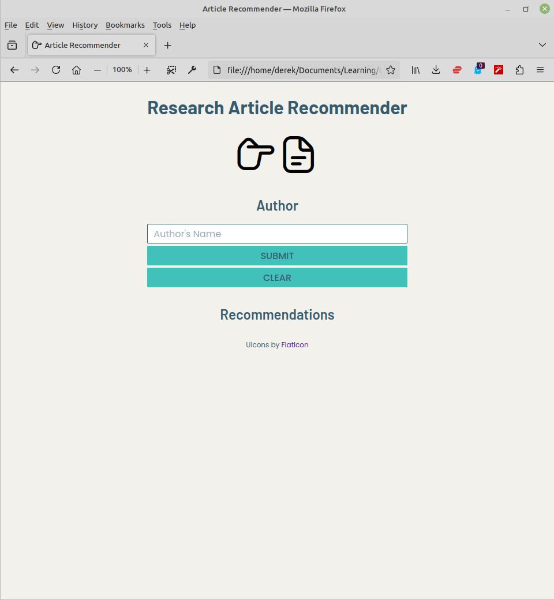
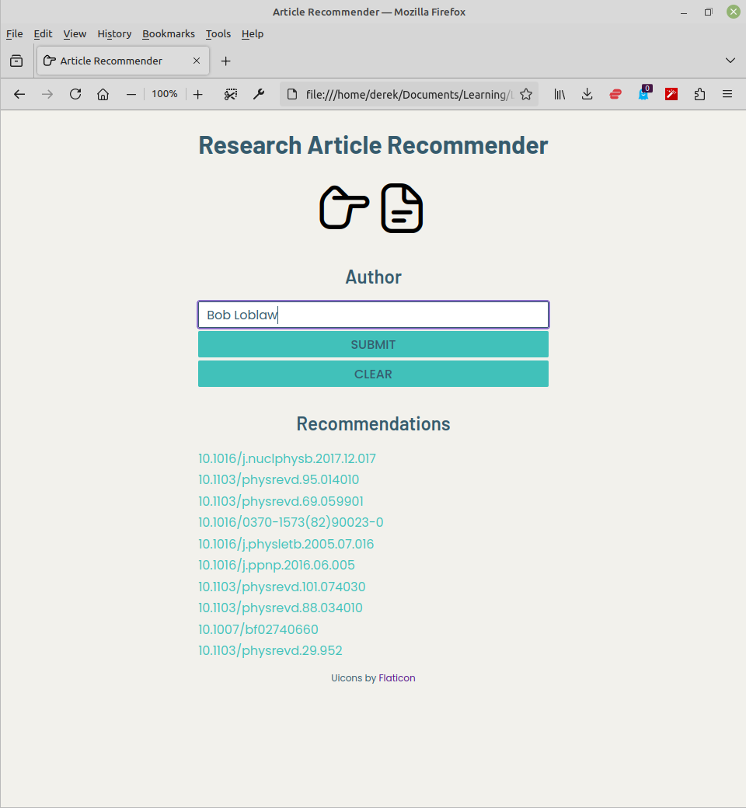

# Research Article Recommender

## Table of Contents

- [Overview](#overview)
- [Installation](#installation)
- [Usage](#usage)
- [Contributing](#contributing)
- [Acknowledgements](#acknowledgements)
- [License](#license)

## Overview

This research-article recommender is a collaborative recommender that uses both a K-nearest neighbours algorithm and a matrix-factorization algorithm to recommend research articles based on an author's citation history. 

Article data is obtained using the [CORE API](https://api.core.ac.uk/docs/v3). Citation data is obtained using the [OpenCitations API](https://opencitations.net/index/api/v2). An author-article matrix is generated using citation counts, *i.e.,* the number of times an author has cited a particular article serves as an effective rating for that article. Citation count is perhaps the simplest way to turn citation history into a ratings system, but more complex relationships are certainly worth exploring. In particular, in this work, I included a citation decay factor in the rating system, essentially giving a citation a half-life of 25 years. This is intended to level the playing field between new and old articles.

Using [Surprise](https://surpriselib.com/), author-article citation ratings are fitted to both a `KNNWithMeans` K-nearest neighbours model and an `SVG` matrix-factorization model. For a particular author, the top-ranked articles from each model that **the author has never cited** are combined to yield a recommended collection of research articles.

The application is deployed as a (local) web app, shown in the following screenshots.





## Installation

The backend of this app was written in Python and is served with [Flask](https://flask.palletsprojects.com/en/3.0.x/).

Start by cloning the repo:

```bash
$ git clone git@github.com:harnettd/research-article-recommender.git
$ cd research-article-recommender
```


To setup the needed Python environment, both `requirements.txt` and `environment.yml` are provided, the former for use with `pip` and the latter for use with `conda`. If using `pip`, setup the environment with 

```bash
$ python -m venv venv
$ source venv/bin/activate
$ pip install -r requirements.txt
```

If using `conda`, setup the environment with

```bash
$ conda env create -f environment.yml
$ conda activate capstone
```

Next, set the article search parameters by editing `src/search.py`:

```python
# Search the CORE API for these terms (there's an implied OR) 
# in the title, abstract, and full text of the article (if available).
SEARCH_TERMS = ['diquark', 'tetraquark', 'pentaquark']

# Search for articles published on or after this year.
YEAR = 2000

# The maximum number of articles to be found. Note that 10,000 is
# the upper limit here without a special ID needed for larger
# queries.
LIMIT = 1000
```

You will need API tokens for the [CORE API](https://core.ac.uk/services/api#what-is-included) and the [OpenCitations API](https://opencitations.net/accesstoken). Save the keys to the environment variables `APIKEY_CORE` and `APIKEY_OPENCITATIONS` respectively. Then, run the setup scipt:

```bash
$ source setup.py
```

## Usage

Change to the `src/` directory and start the server:

```bash
$ cd src
$ flask run
```

Then, open `index.html` in a browser window. Enter the name of an author in the text input and click the SUBMIT button. To see a list of the authors that are contained in the data set, point the browser to `http://127.0.0.1:5000/authors`. To see a list of the articles that are in the dataset (as document identifier objecs or DOIs), point the browser to `http://127.0.0.1:5000/dois`. 

## Contributing

If you're interested in contributing to this project, please fork and clone the repo, write some code, and submit a pull request.

## Acknowledgements

I'd like to thank the mentors and staff at [Lighthouse Labs](https://www.lighthouselabs.ca/) for their help and guidance throughout my data science bootcamp experience. 

## Licence

This project is licensed under the MIT License. See [LICENSE](LICENSE) for details.